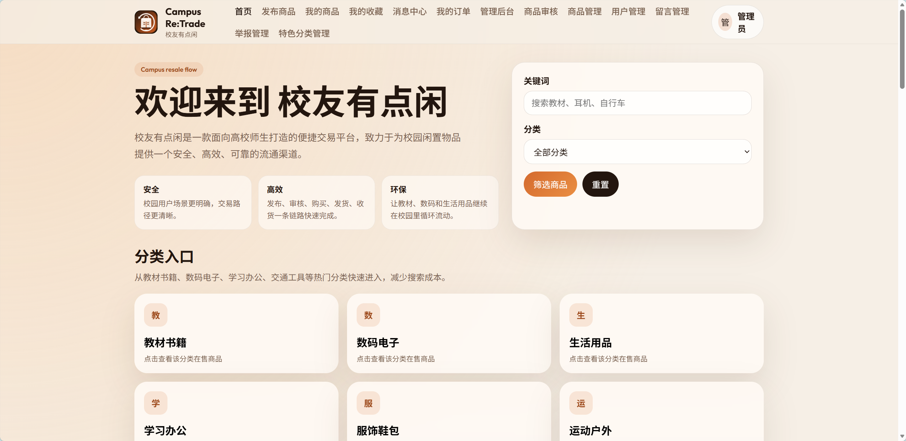

# 校友有点闲 Campus Re:Trade

面向高校师生的校园二手交易平台，采用前后端分离架构，覆盖商品发布审核、交易下单、留言互动、举报治理、公开资料与信用展示等完整业务闭环。



## 项目介绍 📖

校友有点闲聚焦校园二手交易场景，支持普通用户发布商品、管理员审核内容、买家下单购买、卖家发货、买家确认收货，并围绕交易过程扩展了收藏、留言、通知、举报和后台治理能力。

核心业务闭环：

1. 普通用户发布商品
2. 商品进入待审核状态
3. 管理员审核通过后上架展示
4. 买家浏览商品并提交订单
5. 卖家发货
6. 买家确认收货
7. 用户围绕商品进行收藏、留言、举报
8. 管理员进行留言监管、举报处理和信用治理

## 主要功能 ✨

用户侧：

1. 用户注册与登录
2. JWT 登录鉴权
3. 个人资料查看与修改
4. 头像上传与公开资料展示
5. 商品浏览、详情查看、发布、编辑、上下架
6. 商品多图上传与展示
7. 加入购物车与提交订单
8. 买家订单查看、取消、确认收货
9. 卖家订单查看与发货
10. 商品收藏、取消收藏、我的收藏
11. 商品留言、递归回复、站内消息通知
12. 商品举报与举报处理结果查看
13. 信用分、信用等级与成交统计展示

管理员侧：

1. 管理后台总览
2. 用户总数、商品总数、订单总数、待审核商品统计
3. 近 7 天趋势统计与分类分布统计
4. 商品审核、商品管理、用户管理
5. 留言管理、举报管理与处理
6. 特色分类管理与首页特色专区维护

## 技术栈 🛠️

后端：

1. Java 17
2. Spring Boot 3.2.5
3. MyBatis-Plus 3.5.6
4. MySQL
5. JWT
6. BCrypt
7. Maven
8. Lombok

前端：

1. Vue 3
2. Vite
3. Vue Router
4. Pinia
5. Axios
6. ECharts

## 系统需求 ⚙️

1. JDK 17 或更高版本
2. Maven 3.6 或更高版本
3. Node.js 18+ 与 npm
4. MySQL 8.0 或更高版本
5. 可用的 8081 和 5173 端口

## 快速开始 🚀

### 1. 克隆项目

```bash
git clone <your-repo-url>
cd CampusRetrade
```

### 2. 环境准备

1. 启动本地 MySQL 服务。
2. 确认你有可用的 MySQL 用户名和密码。
3. 打开 [backend/src/main/resources/application.yml](backend/src/main/resources/application.yml)，将占位配置改为你本地真实可用配置。

必须修改的字段：

1. `spring.datasource.username`
2. `spring.datasource.password`
3. `jwt.secret`

默认数据库名：

```text
campus_trade
```

### 3. 启动后端

```bash
cd backend
mvn spring-boot:run
```

后端默认地址：

```text
http://localhost:8081
```

### 4. 启动前端

```bash
cd frontend
npm install
npm.cmd run dev
```

前端默认地址：

```text
http://localhost:5173
```

### 5. 首次运行验证

1. 打开前端登录页 `http://localhost:5173/login`
2. 使用演示账号登录，确认后端接口可正常访问
3. 访问首页、商品详情页、订单页和后台管理页面，确认主链路正常

## 数据库说明 🗄️

首次启动时，系统会执行：

```text
backend/src/main/resources/schema.sql
backend/src/main/resources/data.sql
```

说明：

1. 如果是首次本地运行且数据库不存在，通常只需 `schema.sql` 和 `data.sql`。
2. `backend/upgrade-existing-db.sql` 仅用于旧版本数据库升级，不想删库重建时使用。
3. `backend/reset-default-passwords.sql` 仅用于旧库中的默认账号密码与当前 BCrypt 登录逻辑不一致时的修复场景。

## 默认账号 🔐

详细账号见：[docs/LOGIN-METHODS.md](docs/LOGIN-METHODS.md)

常用演示账号：

```text
管理员：admin / your_demo_password
普通用户：student1 / your_demo_password
卖家账号：buyer1001 / your_demo_password
买家账号：buyer2001 / your_demo_password
```

## 项目结构 📁

```text
CampusRetrade
├─ README.md
├─ docs
│  ├─ API.md
│  ├─ DATABASE-DESIGN.md
│  ├─ DEVELOPMENT-LOG.md
│  ├─ LOGIN-METHODS.md
│  └─ PROJECT-DEMO-SCRIPT.md
├─ backend
│  ├─ pom.xml
│  ├─ reset-default-passwords.sql
│  ├─ upgrade-existing-db.sql
│  ├─ uploads
│  └─ src
└─ frontend
   ├─ package.json
   ├─ vite.config.js
   └─ src
```

## 文档导航 📚

1. 开发阶段记录：[docs/DEVELOPMENT-LOG.md](docs/DEVELOPMENT-LOG.md)
2. 演示脚本：[docs/PROJECT-DEMO-SCRIPT.md](docs/PROJECT-DEMO-SCRIPT.md)
3. 登录账号说明：[docs/LOGIN-METHODS.md](docs/LOGIN-METHODS.md)
4. 数据库设计说明：[docs/DATABASE-DESIGN.md](docs/DATABASE-DESIGN.md)
5. 接口说明：[docs/API.md](docs/API.md)

## 接口概览 🔌

完整的接口参数、权限要求、错误响应和返回示例见：[docs/API.md](docs/API.md)

认证与用户：

```text
POST /api/auth/register
POST /api/auth/login
GET /api/user/profile
PUT /api/user/profile
PUT /api/user/password
GET /api/user/public/{userId}
```

商品：

```text
GET /api/categories
GET /api/goods/page
GET /api/goods/{goodsId}
GET /api/goods/my
POST /api/goods
PUT /api/goods/{goodsId}
PUT /api/goods/{goodsId}/status
POST /api/files/upload
```

购物车与订单：

```text
POST /api/cart/add
GET /api/cart/list
POST /api/orders/submit
GET /api/orders/my
GET /api/orders/my/sell
PUT /api/orders/{orderId}/ship
PUT /api/orders/{orderId}/finish
PUT /api/orders/{orderId}/cancel
```

举报与后台管理：

```text
POST /api/goods/{goodsId}/report
GET /api/goods-reports/{reportId}
GET /api/admin/statistics/overview
GET /api/admin/statistics/trend
GET /api/admin/statistics/category
GET /api/admin/users/page
GET /api/goods/admin/page
PUT /api/goods/admin/{goodsId}/audit
GET /api/admin/goods-messages/page
GET /api/admin/goods-reports/page
PUT /api/admin/goods-reports/{reportId}/handle
```

## 测试说明 ✅

当前已补充的后端自动化测试包括：

1. 服务层关键集成测试：登录、商品审核、订单流转、举报处理
2. Controller 层接口测试：登录、订单、举报、管理员权限拦截与参数校验
3. 测试环境使用 H2，便于本地快速执行

执行方式：

```bash
cd backend
mvn test
```

## 常见问题（FAQ）❓

### 1. 后端启动失败，提示数据库连接错误？

1. 检查 [backend/src/main/resources/application.yml](backend/src/main/resources/application.yml) 中的 `spring.datasource.url`、`username`、`password` 是否已改为本地真实配置。
2. 确认 MySQL 服务已启动。
3. 确认当前用户有权限创建或访问 `campus_trade` 数据库。

### 2. 默认账号登录失败怎么办？

1. 如果是全新首次运行，确认 `schema.sql` 和 `data.sql` 已执行。
2. 如果使用的是旧数据库，执行 [backend/reset-default-passwords.sql](backend/reset-default-passwords.sql) 修复默认账号密码。

### 3. 图片上传后无法访问怎么办？

1. 检查 `backend/uploads` 目录是否生成了文件。
2. 检查 `file.upload-dir` 与 `file.access-path` 配置是否被修改。
3. 确认前端访问的是 `/uploads/**` 路径。

### 4. 端口被占用怎么办？

1. 后端默认端口是 `8081`
2. 前端默认端口是 `5173`
3. 如果端口冲突，可以修改 [backend/src/main/resources/application.yml](backend/src/main/resources/application.yml) 或 [frontend/vite.config.js](frontend/vite.config.js) 中的端口配置。

### 5. 首次运行为什么不需要执行旧库脚本？

1. 因为 `schema.sql` 和 `data.sql` 已经覆盖全新数据库初始化。
2. `upgrade-existing-db.sql` 和 `reset-default-passwords.sql` 仅用于旧库兼容场景。

## 项目亮点 ⭐

1. 前后端分离，结构清晰，便于联调和演示
2. JWT 鉴权区分普通用户和管理员权限
3. 商品发布后需管理员审核，形成内容治理流程
4. 支持购物车、订单提交、发货、确认收货的交易闭环
5. 支持收藏、留言、回复、通知、举报和信用统计
6. 管理后台覆盖统计、审核、商品、用户、留言、举报和特色分类管理
7. 已补充后端服务层与 Controller 层关键自动化测试

## 免责声明 ⚠️

本项目仅用于课程学习、技术研究、作品展示和本地演示，不保证满足生产环境的安全性、稳定性与合规性要求。

1. 请勿将仓库中的占位配置直接用于生产环境。
2. 请勿在公开仓库中提交真实数据库密码、JWT 密钥、个人隐私数据或其他敏感信息。
3. 项目中的上传资源、演示账号、测试数据和静态素材请由使用者自行甄别其合法性、隐私性与版权归属。
4. 因部署、运行、数据处理、素材使用或二次开发产生的任何直接或间接问题，由使用者自行承担责任。

## 后续优化方向 🧭

1. 继续补充更多后端测试覆盖，完善商品、用户通知、异常分支和权限边界场景
2. 补充 Swagger UI 或 OpenAPI 自动化文档
3. 拆分开发、测试、生产环境配置
4. 使用环境变量管理数据库密码和 JWT secret
5. 引入 Flyway 或 Liquibase 管理数据库版本迁移
6. 补充 Docker Compose 一键启动环境
7. 为订单增加超时关闭、售后等扩展状态
8. 为举报和留言补充敏感词过滤、频率限制和更完整的风控策略
